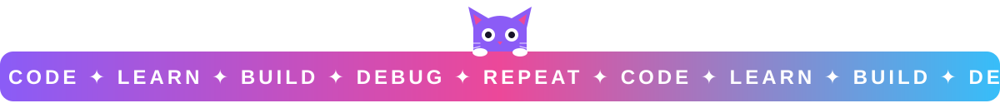

<a href="https://vxrshh14-era.github.io/portfolio/">
  
</a>

<p align="center">
  <a href="https://vxrshh14-era.github.io/portfolio/"></a>
  <a href="mailto:vxrshh14@gmail.com"></a>
</p>

## 🐾 About me

- 🎓 First-year **B.E. Computer Science and Engineering** student at **SRM Valliammai Engineering College** (2026 – 2030)
- 🌱 Building my foundations in programming and the web
- 🎯 Goal for year one: finish my first few small projects and get comfortable with Git
- 🐱 The cat above lives on my [portfolio](https://vxrshh14-era.github.io/portfolio/) too. Click it there for a surprise

## 🌱 Learning now

<p>
  
  
  
  
  
</p>

## 🚀 Up next

<p>
  
  
  
  
</p>

## 🛠️ Projects

| Project | What it is | Status |
| --- | --- | --- |
| **[Portfolio](https://vxrshh14-era.github.io/portfolio/)** | My animated personal site, built with plain HTML, CSS and JavaScript | 🟢 Live |
| **GPA Calculator** | A small C program to work out semester GPA | 🟡 Planned |
| **To-Do List App** | A task tracker that saves in the browser | 🟡 Planned |

## 🗺️ My four-year roadmap

```text
Year 1  ██████░░░░░░░░░░░░░░░░░░  Foundations      <- you are here
Year 2  ░░░░░░░░░░░░░░░░░░░░░░░░  Core CS
Year 3  ░░░░░░░░░░░░░░░░░░░░░░░░  Build & intern
Year 4  ░░░░░░░░░░░░░░░░░░░░░░░░  Launch
```


